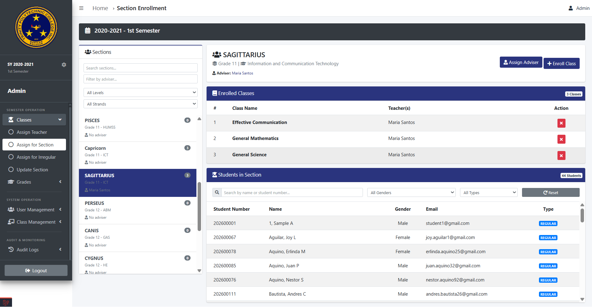
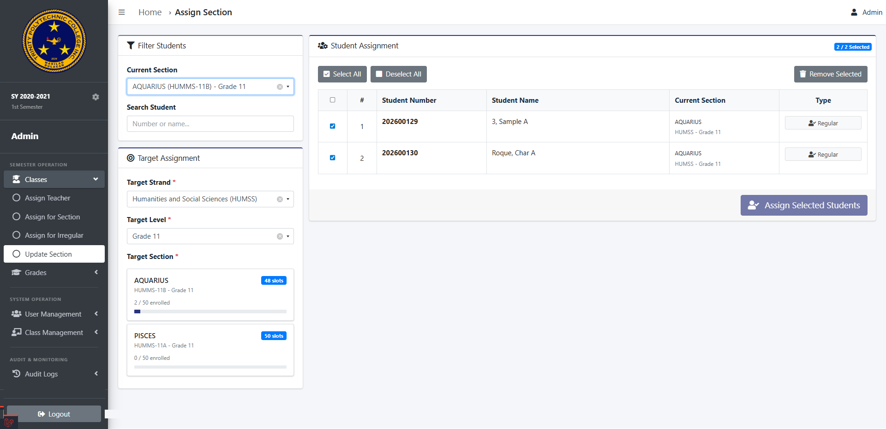
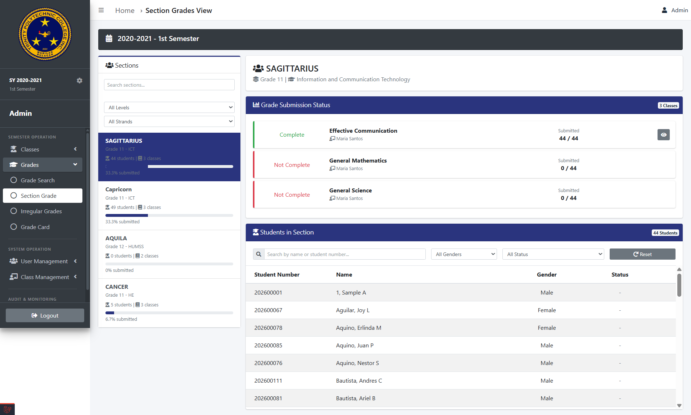
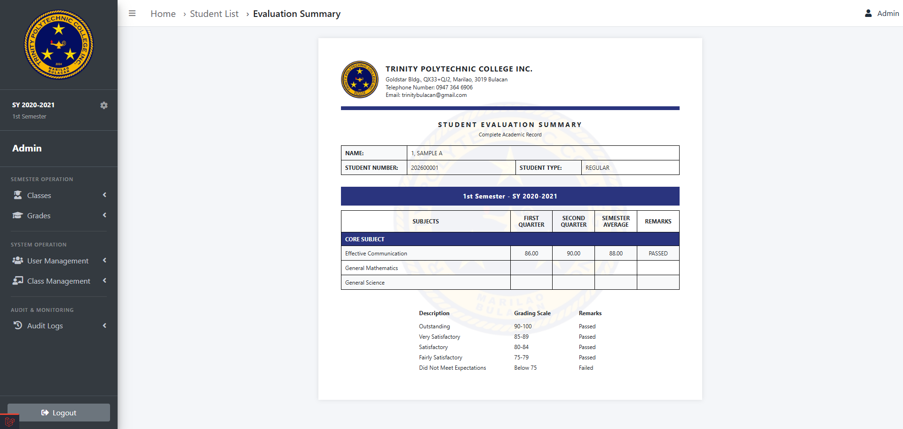
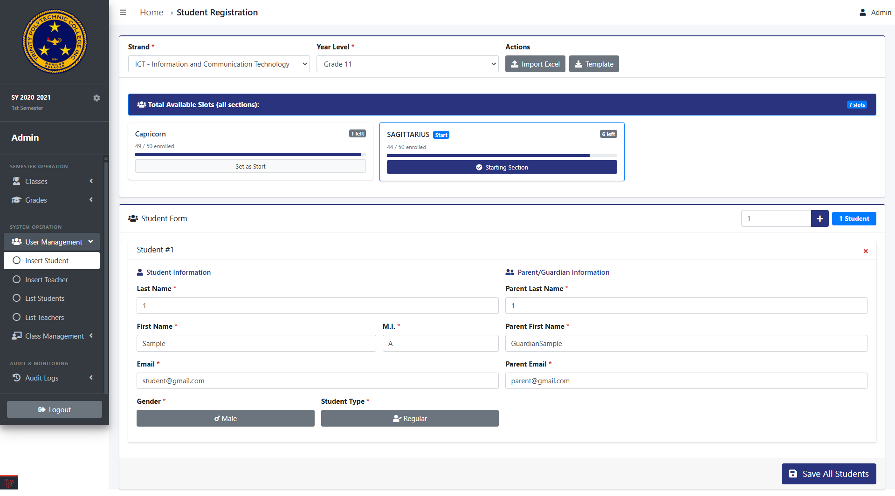
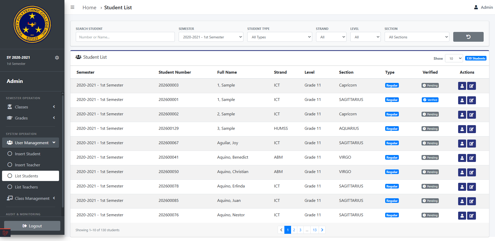
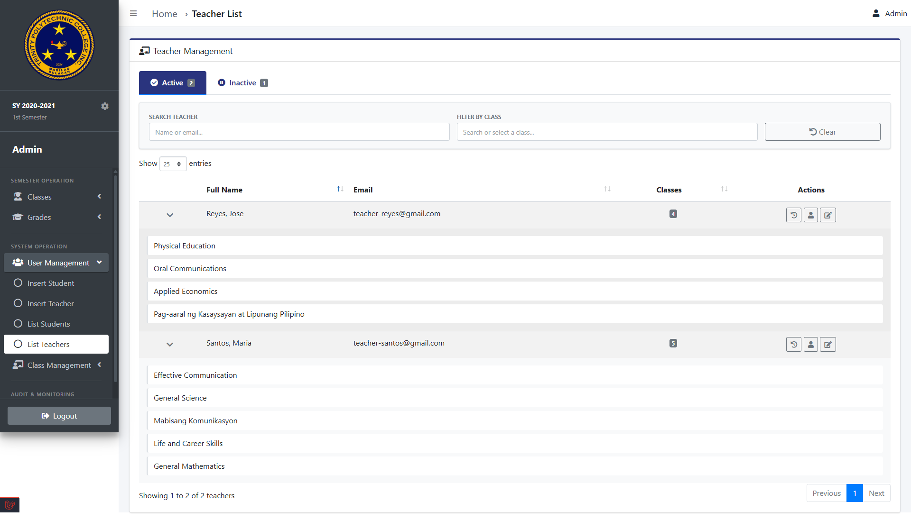
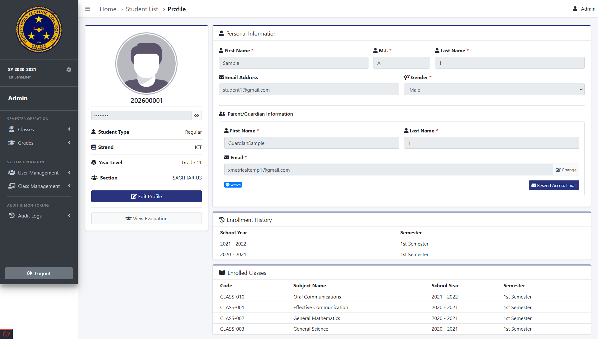
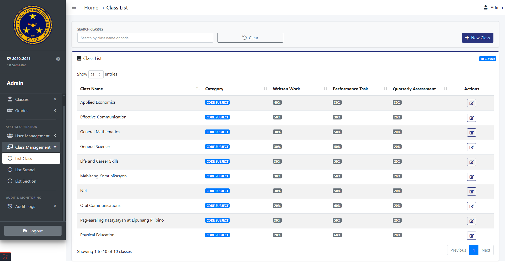
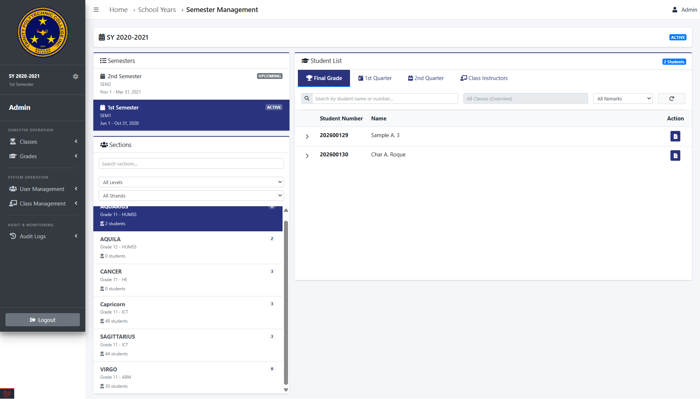

# Trinity Learning Management System

A web-based Learning Management System built with Laravel and Bootstrap.
Supports multiple roles — Super Admin, Admin, Teacher, and Student — each with their own portal and access level.

---

## Table of Contents

- [About](#about)
- [Screenshots](#screenshots)
- [Modules](#modules)
- [Tech Stack](#tech-stack)
- [Setup](#setup)
- [Roles](#roles)

---

## About

Built for Trinity, this system manages the full academic cycle — from setting up school years and semesters, assigning teachers and sections, tracking student grades, to monitoring all user activity through audit logs. Access is controlled per role, so each user only sees what's relevant to them.

---

## Screenshots

> Screenshots are organized by role inside the `/screenshots` folder.

---

### Admin

#### Semester Operation — Classes

| Assign Class | Section Reassignment |
|---|---|
|  |  |

#### Semester Operation — Grades

| Grade Section | Grade Card |
|---|---|
|  |  |

#### User Management

| Create Student | List Students |
|---|---|
|  |  |

| List Teachers | Student Profile |
|---|---|
|  |  |

#### Class Management

| List Class |
|---|
|  |

#### Audit & Monitoring

| Historical Records |
|---|
|  |

---

> 📌 More screenshots coming — Teacher and Student role screenshots will be added here.

---

## Modules

### Admin

**Semester Operation**
- Classes — Assign Teacher, Assign for Section, Assign for Irregular, Update Section
- Grades — Grade Search, Section Grade, Irregular Grades, Grade Card

**System Operation**
- User Management — Insert/List Students, Insert/List Teachers
- Class Management — List Class, List Strand, List Section

**Audit & Monitoring**
- Admin Activity, Teacher Activity, Student Activity, Login History

### Super Admin

Everything the Admin has, plus:
- Admin Management — Insert Admin, List Admins
- School Year / Semester management

---

## Tech Stack

- **Backend** — Laravel (PHP)
- **Frontend** — Bootstrap, AdminLTE, Font Awesome
- **Database** — MySQL
- **Auth** — Laravel Auth with role-based access control

---

## Setup

```bash
git clone https://github.com/Zmetrical/Laravel-LMS.git
cd Laravel-LMS

composer install
npm install && npm run dev

cp .env.example .env
php artisan key:generate
```

Update your `.env` with your database credentials, then:

```bash
php artisan migrate --seed
php artisan storage:link
php artisan serve
```

---

## Roles

| Role | Access |
|------|--------|
| `super_admin` | Full system access — manages admins, school years, all modules |
| `admin` | Semester operations, grades, class and user management, audit logs |
| `teacher` | *(coming soon)* |
| `student` | *(coming soon)* |

---

> Built with Laravel & Bootstrap · Trinity School
